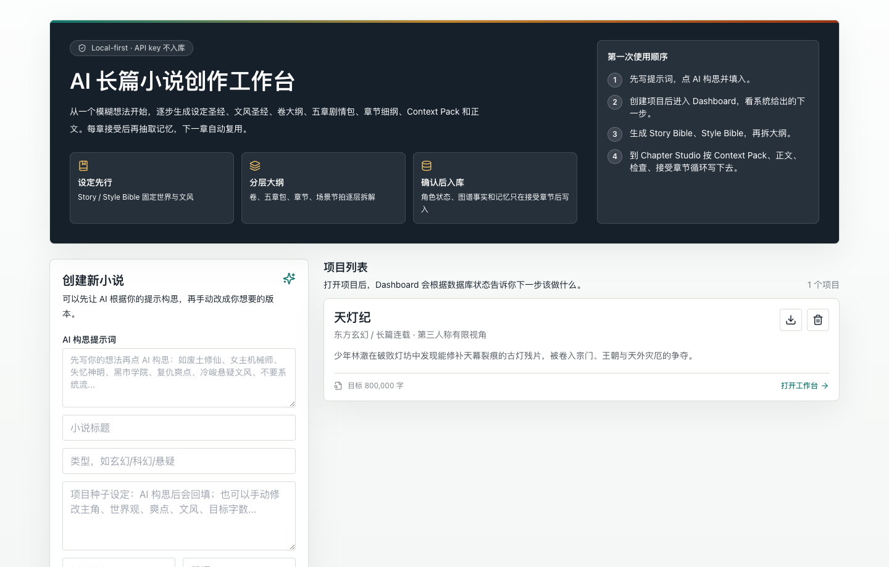
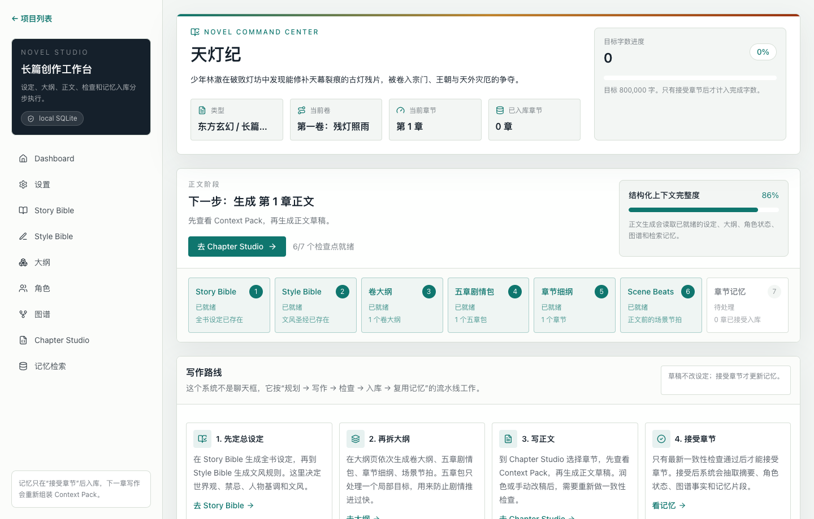
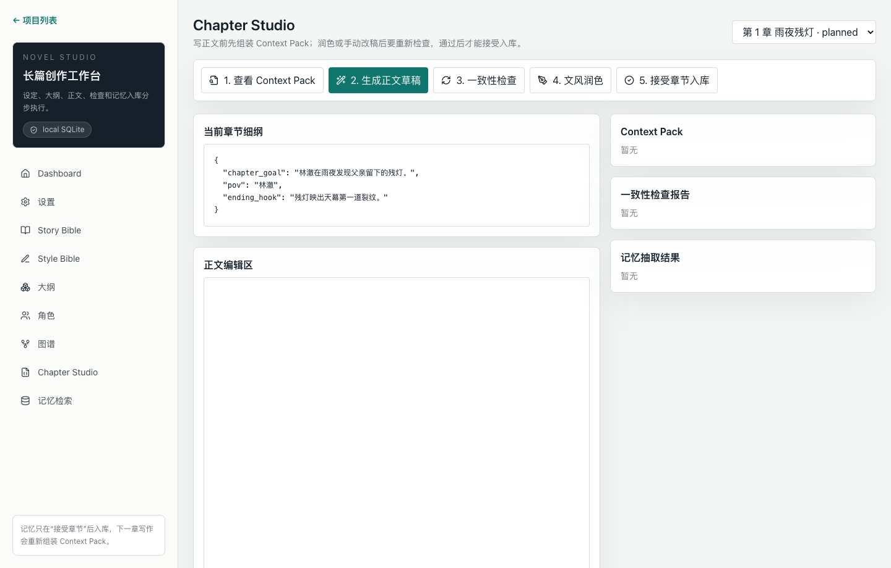

# Novel Studio AI

[简体中文](README.zh-CN.md) | [English](README.md)

本地优先的 AI 长篇小说创作工作台，支持设定圣经、大纲、角色状态、图谱事实、检索记忆和一致性检查。

Novel Studio AI 不是普通聊天界面，而是围绕“设定圣经 + 文风圣经 + 大纲系统 + 角色状态表 + 三元组图谱 + 检索记忆 + 最近三章上下文 + 一致性检查”组织长篇连载写作。它会把临时草稿和已确认正文分开，避免模型只靠聊天上下文记整本书。

## 界面截图

### 项目启动台



### 小说控制台



### Chapter Studio



## 为什么做这个项目

AI 写长篇时经常会遗忘前文、人物状态错乱、地点跳跃、道具归属混乱、死亡角色随意行动，或者文风越写越飘。这个项目把每个已接受章节都当成一次结构化记忆更新：

```text
规划
→ 组装 Context Pack
→ 生成正文草稿
→ 一致性检查
→ 文风润色
→ 接受章节
→ 抽取记忆
→ 下一章复用记忆
```

草稿不会直接改数据库。只有用户点击“接受章节”后，系统才会把章节摘要、角色状态、三元组事实、时间线事件和记忆片段写入本地 SQLite。

## 功能

- 多小说项目管理
- Story Bible 生成、编辑和版本保存
- Style Bible 生成、编辑和版本保存
- 卷大纲、五章剧情包、章节细纲、Scene Beats
- Chapter Studio：Context Pack 预览、正文生成、一致性检查、文风润色、接受章节
- 角色分级和版本化角色状态
- 三元组关系事实表
- 混合检索：关键词、图谱事实、角色状态、时间线、本地向量检索
- 本地 SQLite 持久化
- 通过 OpenAI 官方 JS SDK 支持 OpenAI-compatible API
- Zod 校验结构化模型输出
- Markdown / JSON 导出
- API key 支持 `.env.local` 或浏览器 `sessionStorage`

## 技术栈

- TypeScript
- Next.js App Router
- React
- Tailwind CSS
- SQLite + better-sqlite3
- OpenAI 官方 JavaScript SDK
- Zod
- Vitest

## 快速开始

```bash
npm install
cp .env.example .env.local
npm run db:migrate
npm run db:seed
npm run dev
```

打开 [http://localhost:3000](http://localhost:3000)。

## API Key 设置

支持两种方式：

1. 在 `.env.local` 中设置：

```bash
OPENAI_API_KEY=你的供应商 API key
```

2. 在项目设置页临时输入。前端输入的 key 只保存在浏览器 `sessionStorage`，通过 `x-openai-api-key` 请求头传给本地 API，不会写入数据库。

API key 不会写入 SQLite，写入 `generation_runs` 前也会被脱敏。

### DeepSeek / OpenAI-Compatible Provider

如果接入 DeepSeek 或其他 OpenAI-compatible 服务，可以配置：

```bash
OPENAI_API_KEY=你的供应商 API key
OPENAI_BASE_URL=https://api.deepseek.com
DEFAULT_MODEL=deepseek-v4-pro
EMBEDDING_MODEL=local-hash
```

模型名和 base URL 以供应商文档为准。

## 写作流程

推荐流程：

1. 创建小说项目。
2. 生成并检查 Story Bible。
3. 生成并检查 Style Bible。
4. 生成卷大纲。
5. 生成五章剧情包。
6. 生成章节细纲。
7. 生成 Scene Beats。
8. 打开 Chapter Studio，查看 Context Pack。
9. 生成正文草稿。
10. 运行一致性检查。
11. 文风润色或手动修改。
12. 修改后再次运行一致性检查。
13. 接受章节。
14. 继续下一章。

当前五章包写完后，生成下一个五章包，然后重复这个循环。

## Context Pack

每章正文生成前，后端会组装 Context Pack，包含：

- Story Bible
- Style Bible
- 当前卷大纲
- 当前五章剧情包
- 当前章节细纲
- Scene Beats
- 最近三章已接受章节摘要
- 上一章结尾片段
- 当前出场角色状态
- 三元组图谱事实
- 检索记忆片段
- 最近时间线事件
- 禁止违背事项
- 事实优先级

这样生成章节时会优先使用已确认的项目记忆。

## 隐私和本地数据

本项目是本地优先：

- SQLite 数据保存在本地 `data/` 目录。
- `.env.local` 已被 git 忽略。
- API key 不写入数据库。
- `generation_runs` 会脱敏 API key 类字段。
- 默认向量检索在本地执行。
- 不需要外部数据库、Firebase、Supabase、Pinecone、Neo4j 或托管向量服务。

发布到 GitHub 时默认忽略：

- `.env.local`
- `data/`
- `.next/`
- `node_modules/`
- 本地 IDE 配置
- 本地计划和会话记录

## 常用命令

```bash
npm run dev        # 启动本地开发服务器
npm run build      # 构建 Next.js 应用
npm test           # 运行 Vitest 测试
npm run db:migrate # 初始化或迁移 SQLite schema
npm run db:seed    # 创建示例玄幻小说项目
```

## 导出

支持导出：

- 单章 Markdown
- 全书 Markdown
- Story Bible JSON
- Character Bible JSON
- Graph Triples JSON
- Project Backup JSON

示例 API：

```text
/api/projects/:id/export?type=chapter&chapterId=:chapterId
/api/projects/:id/export?type=book
/api/projects/:id/export?type=story-bible
/api/projects/:id/export?type=characters
/api/projects/:id/export?type=graph
/api/projects/:id/export?type=backup
```

## 测试覆盖

当前测试覆盖：

- cosine similarity
- Context Pack 最近三章摘要
- 死亡角色冲突的一致性检查 schema
- 记忆抽取 schema 校验
- 角色 tier 晋级
- 三元组有效期查询
- generation logs 中的 API key 脱敏
- 五章剧情包 pacing 检查
- 项目下一步 workflow 计算
- 接受章节门禁

## MVP 说明

- 图谱可视化 MVP 先使用表格。
- embedding 可回退到本地 hash embedding。
- 向量检索使用 SQLite JSON 数组和 TypeScript cosine similarity。
- 一致性检查采用模型检查 + 本地 hard rules。
- 正文生成、一致性检查、文风润色和记忆抽取刻意拆成独立步骤。

## GitHub 信息

推荐仓库名：

```text
novel-studio-ai
```

推荐简介：

```text
Local-first AI long-form fiction writing workbench with story bibles, outlines, character state, graph facts, retrieval memory, and continuity checks.
```
